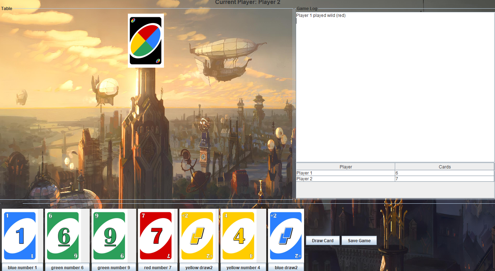

# Uno Game Project

Welcome to the My Uno Game repository! This project is a Java implementation of the popular card game Uno, designed using Object-Oriented Programming (OOP) principles. The project comes in two versions: **Console-based** and **GUI-based**.

---

## Features

- **Console Version**: A text-based version of Uno that runs in the terminal.
- **GUI Version**: A graphical user interface version of Uno for a more interactive experience.
- **Save Game**: The game supports saving and loading the game state.

---

## Prerequisites

Before running the project, ensure you have the following installed:

- **Java Development Kit (JDK)**: Version 11 or higher.
- **IDE**: IntelliJ IDEA, Eclipse, or any Java-supported IDE (optional but recommended).

---

## Saving and Loading the Game

The game supports saving and loading the game state. However, you may need to **correct the file path** for the saving feature to work properly.

### Steps to Correct the File Path
1. Open the `FileHandler` class (or the class responsible for file operations).
2. Locate the file path used for saving and loading the game state.
3. Update the path to match your system's directory structure.
4. Ensure the path points to a valid directory where the game has write permissions.

---

## UML Diagram

The UML diagram for this project was created using Lucidchart. You can view and edit the diagram [here](https://lucid.app/lucidchart/f1763fb8-b38a-4338-b435-fe178a595d8d/edit?viewport_loc=-2223%2C-1085%2C6059%2C3255%2C0_0&invitationId=inv_f2b9ac4c-e2bc-40bb-8429-f194645e188f).

---

## Screenshots

Here’s a screenshot of the game in action:

 <!-- Update the path to your image -->

---

